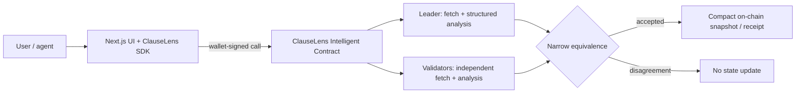

# ClauseLens

**Trustless semantic change adjudication for web terms and API contracts.** ClauseLens uses a GenLayer Intelligent Contract to decide whether a public policy change alters obligations—not merely its HTML.

> Hash monitors tell you that a document changed. ClauseLens asks whether the meaning changed.

## Why this needs GenLayer

A byte or DOM diff treats “100,000 requests/month” → “25,000 requests/month” the same way it treats “Last updated” → “Updated on”. ClauseLens asks validator nodes to independently fetch public evidence, extract compact policy claims, and agree on the decision-critical result. A frontend heuristic is never the authority; the contract updates state only after the equivalence check succeeds.

## Product flows

- **Compare:** submit two public HTTPS URLs, a document type, a short materiality rubric, and relevant categories. The contract creates a persistent adjudication receipt.
- **Monitor:** register a URL. Validator consensus establishes a compact baseline profile; an owner can later check the source and append a bounded on-chain history.
- **Demo Lab:** loads four public text fixtures—cosmetic rewrite, quota reduction, agent-use restriction, and prompt-injection attempt—into Compare. The fixtures are content, not precomputed answers.

Decisions are structured as `NO_CHANGE`, `NON_MATERIAL`, `MATERIAL`, `BREAKING`, or `UNAVAILABLE`, with severity, fixed categories, short evidence excerpts, and a recommended next action. Raw page text is never written to contract storage. Only normalized claims, hashes, and compact receipts persist.

## Architecture



The contract stores watch metadata, the latest normalized baseline profile, at most six recent watch-history IDs, and receipt records. Reads are public. Watch creation/checks are owner-scoped; Compare is open to any caller. The browser connects directly through GenLayerJS on Bradbury; no verdict backend exists.

## Repository map

```text
contracts/ClauseLens.py     Intelligent Contract, URL checks, consensus, compact state
tests/direct/               Mocked GenVM tests, including validator disagreement
tests/integration/          Studio integration smoke test (requires a running Studio)
frontend/                   Responsive Next.js application and public text fixtures
packages/sdk/               Small Bradbury TypeScript client for agents and the UI
deploy/                     GenLayer CLI deployment entrypoint
docs/                       Research, architecture, threat model, consensus, testing
submission/                 Portal copy and reviewer quickstart (links/address left unset)
```

## Local setup

Requirements: Node.js 22+, Python 3.12+, npm, and the current GenLayer CLI. The direct tests run without a Studio node.

```powershell
Copy-Item .env.example frontend/.env.local
npm ci
python -m venv .venv
.\.venv\Scripts\Activate.ps1
pip install -r requirements.txt
```

`NEXT_PUBLIC_CONTRACT_ADDRESS` is intentionally blank until a real Bradbury deployment exists. `NEXT_PUBLIC_DEMO_BASE_URL` should be the public HTTPS origin of the app so validators can fetch its `/demo/...` fixture routes. Localhost, non-HTTPS URLs, explicit ports, URL credentials, and common local hostnames are rejected by the contract.

Run the development server:

```powershell
npm run dev --workspace frontend
```

## Verification

```powershell
$env:PYTHONIOENCODING = "utf-8"
genvm-lint check contracts/ClauseLens.py
python -m pytest tests/direct/test_clauselens.py -v
npm run lint --workspace frontend
npm run build --workspace frontend
```

The `PYTHONIOENCODING` setting avoids a Windows console encoding issue in the linter. For Studio-backed integration, start GenLayer Studio and run `gltest tests/integration/test_clauselens.py -v`; this is separate from the direct-mode test suite.

See [the current test report](docs/TEST_REPORT.md), [consensus design](docs/CONSENSUS_DESIGN.md), and [security model](docs/THREAT_MODEL.md).

## Bradbury deployment

Confirm the currently supported Bradbury network with `genlayer network list`, select `testnet-bradbury`, then deploy `contracts/ClauseLens.py` with the repository’s CLI deployment script. The deployment writes a real contract and requires an explicit wallet approval. Do not use a generated or guessed address. For local testing, put the real address in the untracked `frontend/.env.local`; for GitHub Pages, set the repository variable `NEXT_PUBLIC_CONTRACT_ADDRESS` and push to `main` to rebuild the static site. Exact commands and prerequisites are in [the deployment notes](docs/ARCHITECTURE.md#deployment).

- Live demo URL: https://thunkybin.github.io/clauselens/ (static site deployed; contract not configured yet).
- Bradbury contract: not deployed yet.
- Transaction/explorer evidence: none yet.

## Important limitations

- This is a testnet MVP, not legal advice or an authoritative interpretation of contract law.
- Source content is mutable. A changed source fingerprint during validator execution causes disagreement; retrying can be necessary.
- URL filtering rejects common local/credential/port forms, but is not a substitute for a GenVM-level outbound-network policy or DNS-rebinding defense.
- LLM extraction is lossy. The contract persists compact claims and a hash, not full source text; reviewers should inspect the evidence excerpt and original URL.
- Scheduled polling and notifications are intentionally not included; a watch check is an explicit transaction.
- Integration tests and a live Bradbury smoke test remain unverified until a Studio/testnet deployment is authorized and available.

## Roadmap

1. Multi-source evidence across terms, pricing, changelogs, and API docs.
2. Agent webhooks and policy-based automated responses using the SDK.
3. Adjudication receipt adapters for agent dispute workflows.
4. Cross-chain receipt verification using a GenLayer bridge pattern.
5. Public policy registry with source reputation and long-term history.

MIT licensed. See [LICENSE](LICENSE).
